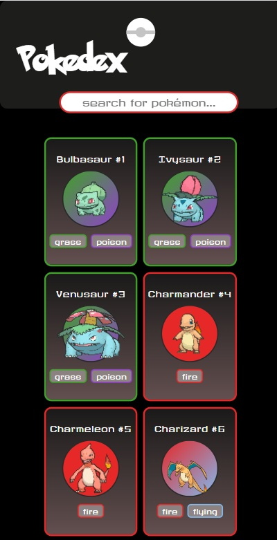
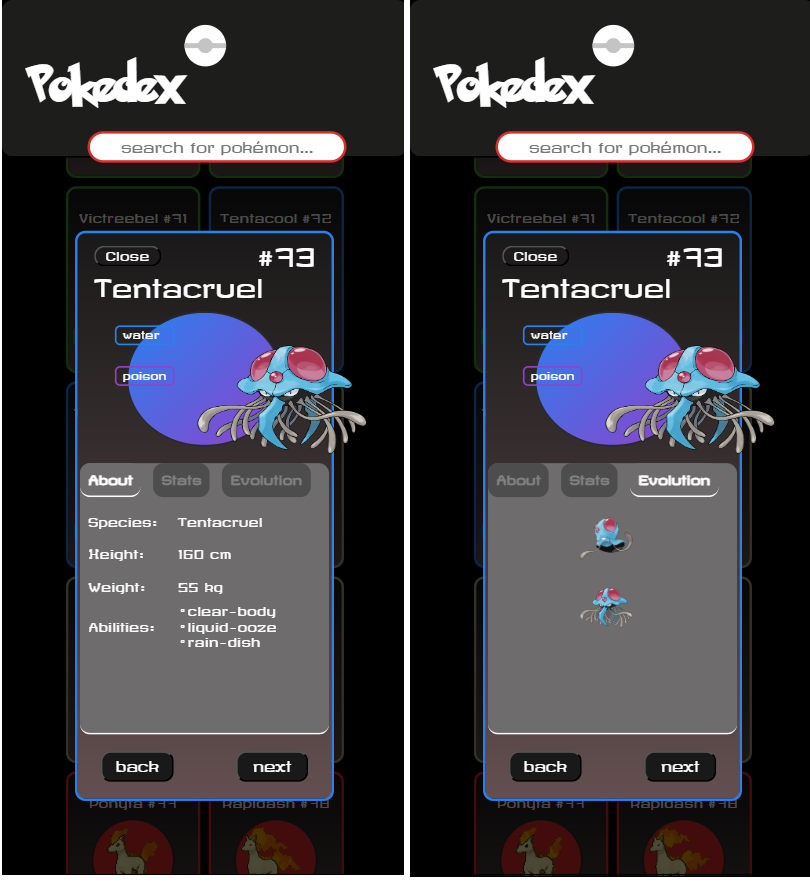
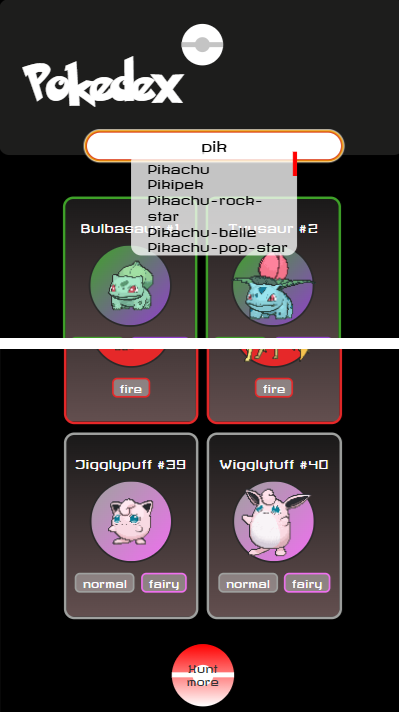

# 🥙 Pokédex App

A responsive, browser-based Pokédex built with JavaScript, HTML, and CSS. It fetches data from the public [PokeAPI](https://pokeapi.co/about) to display Pokémon cards, detailed information dialogs, and evolution chains.

## Demo

Live demo: [Go and hunt!](https://michelle-bit-web.github.io/pokedex)

## 🪄 Features

🔎 Searchable Pokédex - Search for Pokémon by name.

🎨 Dynamic Pokémon Cards - Displays type-based colored cards for each Pokémon.

🫳 Interactive Detail View – Click a card to open a dialog with multiple categories:
- About - Basic information
- Stats - Base stats
- Evolution - Full evolution chain 

🧭 Dialog navigation – Switch between dialog tabs without reloading.

🧩 Smooth UI interaction – Loading spinner, animations & responsive layout. 

## 📸 Screenshots

Main page preview:

Dialog preview:

Search & Loading:

## ⚙️ Technologies Used

- [PokeAPI](https://pokeapi.co/about)
- HTML
- CSS
- JavaScript

## 🚀 Getting Started

It´s a frontend project, so no installation required. Simply:

1. Clone the repository.
2. Open index.html in your browser.

## Project Structure
pokedex-app/
├── index.html
├── impressum.html
├── style.css
├── script.js
├── assets/
│   └── (font, icons, images)
├── scripts/
│   └── (db.js, template.js)

## 🤝 Contributing

Ideas and feedback are welcome! Feel free to open issues or submit pull requests.

##💡To-Dos / Ideas

- [ ] 📍 Including search by ID and/or type.

- [ ] 🩷 Like function to save pokémon as favs.

- [ ] 💡 Base stats with visual bars.

- [ ] 💡 Improve game logic.
   
## 🤓 Author

Created by [Michelle Puschkarow].
If you like this project, feel free to give it a ⭐️ or contribute!

